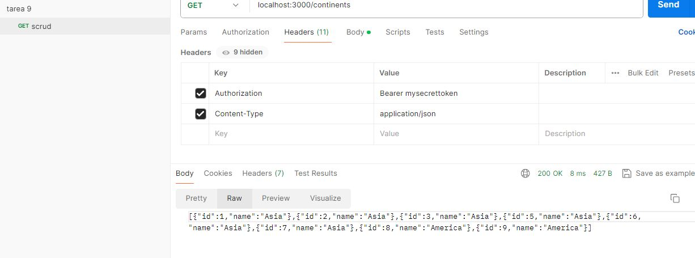
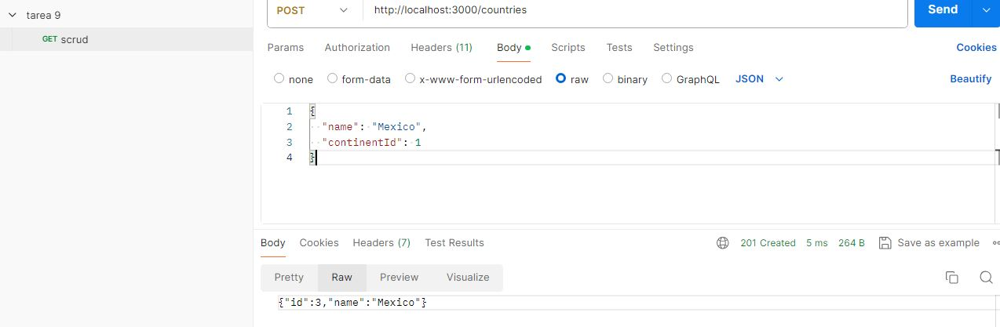
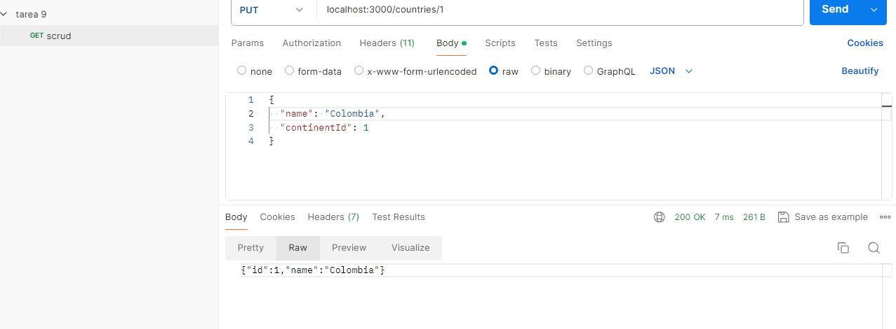

# API RESTful para Países y Continentes

# Endpoints

## Países

- **GET /countries**
  - Obtener la lista de todos los países.

- **GET /countries/:id**
  - Obtener los detalles de un país específico por su ID.

- **POST /countries**
  - Crear un nuevo país.
  - Body: `{ "name": "colombia", "continentId": "1" }`

- **PUT /countries/:id**
  - Actualizar los detalles de un país existente por su ID.
  - Body: `{ "name": "mexico", "continentId": "2" }`

- **DELETE /countries/:id**
  - Eliminar un país por su ID.
  localhost:3000/countries

### Continentes

- **GET /continents**
  - Obtener la lista de todos los continentes.
  

- **GET /continents/:id**
  - Obtener los detalles de un continente específico por su ID.

- **POST /continents**
  - Crear un nuevo continente.
  - Body: `{ "name": "asia" }`
  localhost:3000/continents

- **PUT /continents/:id**
  - Actualizar los detalles de un continente existente por su ID.
  - Body: `{ "name": "asia" }`
  localhost:3000/continents/
  

- **DELETE /continents/:id**
    localhost:3000/continents/5
  - Eliminar un continente por su ID.

## Autenticación

- Las rutas están protegidas con autenticación básica. Se debe incluir un header `Authorization` con el valor `Bearer mysecrettoken` para acceder a los endpoints para poder realizar los metodos POST,PUT,DELETE.

