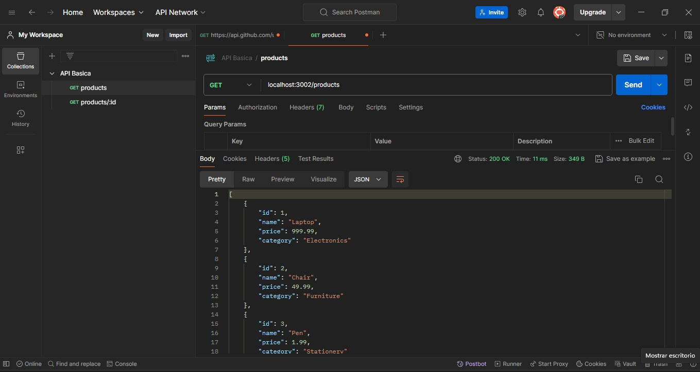
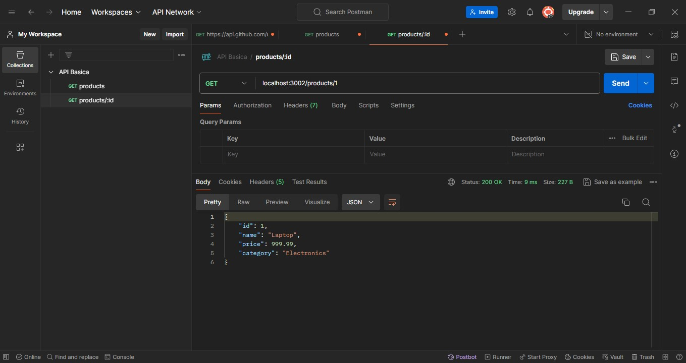
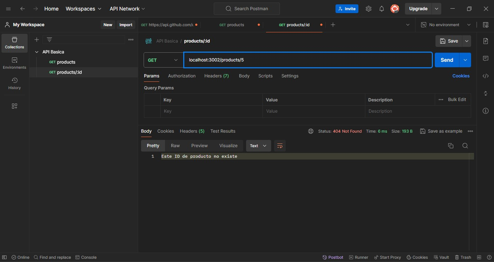

## API Basica
## Descripcion
La siguiente API gestiona una lista de productos

## Instalación
1. Dirigirse hasta la ruta donde se va ejecutar el proyecto
2. En este caso seria la siguiente: backend-js-M5-G20/edwin-sotelo/C6
3. Al encontrarnos en la anterior ruta ejecutamos npm.init el cual nos genera el package.json
4. Procedemos a modificar la informacion que deseamos de archivo generado
5. Creamos el archivo de inicio en este caso se nombro http.js
6. Implementamos el codigo para el desarrollo del servidor http, funcionara con el puerto 3002

## Aplicacion
1. Abrir la terminal y dirigirse a la ubicacion del proyecto y ubicar el archivo http.js
2. En este caso seria la siguiente: backend-js-M5-G20/edwin-sotelo/C6/http.js
3. Ejecutar el archivo anteriormente mencionado de la siguiente manera nodemon http.js 
4. Procedemos a utilizar la aplicacion de Postman donde podemos realizar algunas pruebas
   como a continuacion:

## pruebas
1. Verificacion de todos los productos con Postman:

2. Verificacion de un producto por ID:

3. Verificacion por ID de un producto que no existe:

