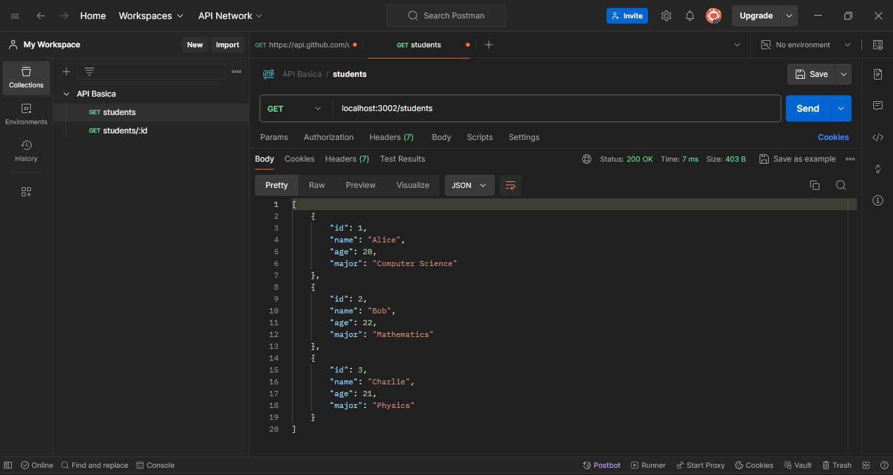

## API Básica con Express
## Descripcion
La siguiente API gestiona una lista de estudiantes

## Instalación
1. Dirigirse hasta la ruta donde se va ejecutar el proyecto
2. En este caso seria la siguiente: backend-js-M5-G20/edwin-sotelo/C7
3. Al encontrarnos en la anterior ruta ejecutamos npm.init el cual nos genera el package.json
4. Procedemos a modificar la informacion que deseamos de archivo generado
5. Creamos el archivo de inicio en este caso se nombro express.js
6. Implementamos el codigo para el desarrollo del servidor express, funcionara con el puerto 3002

## Aplicacion
1. Abrir la terminal y dirigirse a la ubicacion del proyecto y ubicar el archivo express.js
2. En este caso seria la siguiente: backend-js-M5-G20/edwin-sotelo/C7/express.js
3. Ejecutar el archivo anteriormente mencionado de la siguiente manera nodemon express.js 
4. Procedemos a utilizar la aplicacion de Postman donde podemos realizar algunas pruebas
   como a continuacion:

## pruebas
1. Verificacion de la lista de estudiantes:

2. Verificacion de un estudiante por ID:

3. Verificacion por ID de un pestudiante que no existe:

