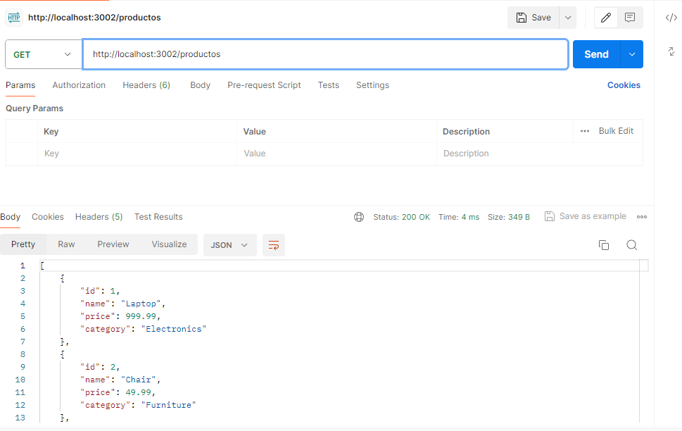
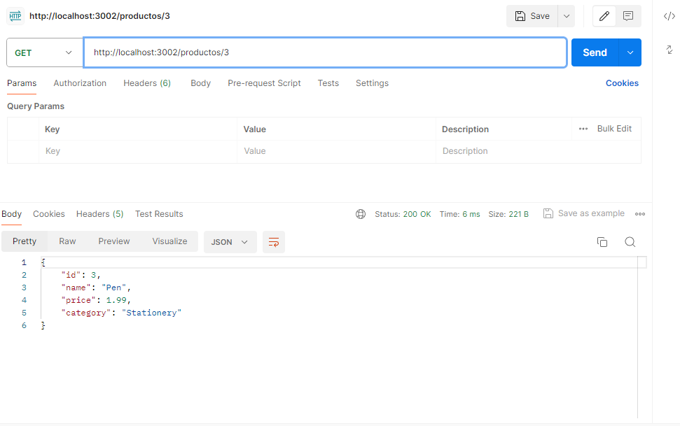

# Products API

Esta es una API básica para gestionar una lista de productos utilizando Node.js y la librería `http`.

## Endpoints

### GET /productos
Retorna la lista de todos los productos.

- **URL**: `http://localhost:3002/productos`
- **Método**: GET
- **Respuesta Exitosa**: 200 OK
    ```json
    [
        { "id": 1, "name": "Laptop", "price": 999.99, "category": "Electronics" },
        { "id": 2, "name": "Chair", "price": 49.99, "category": "Furniture" },
        { "id": 3, "name": "Pen", "price": 1.99, "category": "Stationery" }
    ]
    ```

### GET /productos por id
Retorna los detalles de un producto específico basado en el ID.

- **URL**: `http://localhost:3002/productos/1`
- **Método**: GET
- **Respuesta Exitosa**: 200 OK
    ```json
    { "id": 1, "name": "Laptop", "price": 999.99, "category": "Electronics" }
    ```
- **Respuesta Error**: 404 Not Found
    ```json
    { "error": "Product not found" }
    ```

## Ejecución del Servidor

1. Asegúrate de tener Node.js instalado.
2. Navega a la carpeta del proyecto.
3. Ejecuta el servidor:
    ```bash
    npm start
    ```
4. El servidor estará corriendo en el puerto 3002.

## Pruebas

Pantallazos de Postman para probar los endpoints.

## Productos

## Por Id

