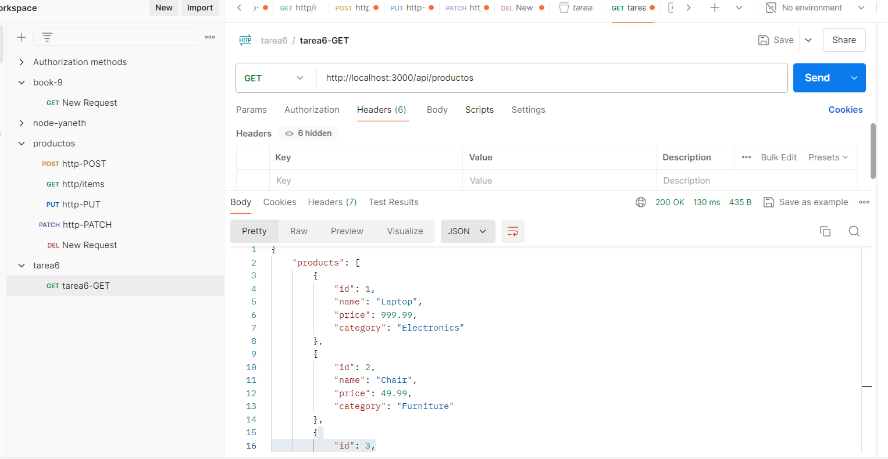

## Tarea: Crear una API Básica con Node.js

### Objetivos

1. Crear un servidor HTTP utilizando la librería http de Node.js.
2. Implementar dos endpoints accesibles mediante el método GET.
3. Utilizar un array o un archivo .json como base de datos.

### Descripción de la tarea

1. Debes crear una pequeña API que gestione una lista de productos. Tu API debe correr por el puerto `3002`

2. Usa la librería `http` de Node.js para crear el servidor.

3. La API debe tener dos endpoints:

    - `GET /products:` Este endpoint debe retornar la lista de todos los productos en formato JSON.
    - `GET /products/:id` Este endpoint debe devolver los detalles de un producto específico basado en el ID. Si no se encuentra el producto, debe devolver un mensaje de error apropiado.

4. **Formato de datos:** Cada producto debe ser un objeto con las siguientes propiedades:  `id` (número), `name` (string), `price` (número), y `category` (string). Los datos deben estar guardados en una variable, a continuación encontrarás un ejemplo de tu base de datos

    ```javascript
        const products = [
            { id: 1, name: 'Laptop', price: 999.99, category: 'Electronics' },
            { id: 2, name: 'Chair', price: 49.99, category: 'Furniture' },
            { id: 3, name: 'Pen', price: 1.99, category: 'Stationery' }
        ];
    ```

5. **Opcional**: Puedes usar un archivo .json como base de datos en lugar de crear una constante como la descrita en el paso 4. En este caso el archivo que debes usar debe ser como el siguiente:

    products.json

    ```json
        [
            { "id": 1, "name": "Laptop", "price": 999.99, "category": "Electronics" },
            { "id": 2, "name": "Chair", "price": 49.99, "category": "Furniture" },
            { "id": 3, "name": "Pen", "price": 1.99, "category": "Stationery" }
        ];
    ```

6. Documenta y prueba tu API usando postman y envia la evidencia a el docente. Puedes agregar un archivo README.md a tu API para documentar como usarla y agregar los pantallazos de postman

### Desarrollo de la tarea:

1. Crear un servidor HTTP utilizando la librería http de Node.js.
Con las instrucciones dadas en las clases se crea el servidor.


 ```javascript
        
const http = require('http');

const server = http.createServer((req, res) => {
    if (req.url === '/' && req.method === 'GET') {
        res.writeHead(200, {'Content-Type': 'text-plain'});
        res.writeHead(200, {'Content-Type': 'text-plain'});
        res.end('Ejecutado correctamente');
    } else if (req.url === '/saludo' && req.method === 'GET') {
        res.writeHead(200, {'Content-Type': 'text-plain'});
        res.end('Ejecutado, hola, soy el primero en crear esto');
    } else if (req.url === '/users' && req.method === 'GET') {
        res.writeHead(200, {'Content-Type': 'text-plain'});
        res.end('Hola, estos son mis users');
    } else {
        res.writeHead(404, {'Content-Type': 'text-plain'});
        res.end('Ruta no está especificada');
    }
});

const PORT = process.env.PORT || 3000;
server.listen(PORT, () => {
    console.log(`Servidor arriba, Yaneth ${PORT}`);
});

```


2. Implementar dos endpoints accesibles mediante el método GET.

Se implementan los dos endpoinst y se realizan las pruebas, para verificar que funcione bien.




3. Utilizar un array o un archivo .json como base de datos.

Se utilizo el array y tambien se utilizo un archivo creado en .json, llamado productos.

